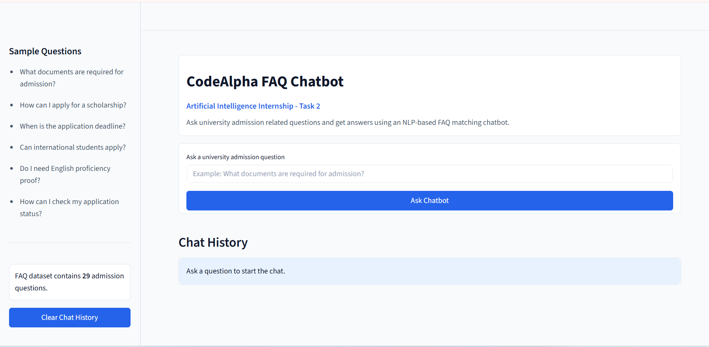
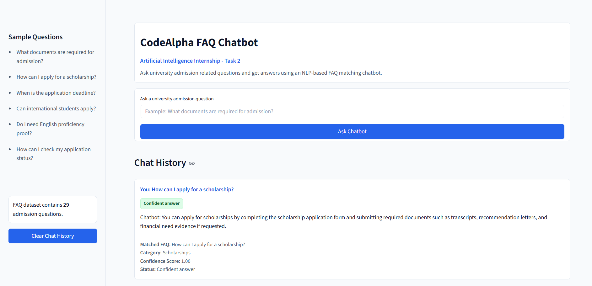
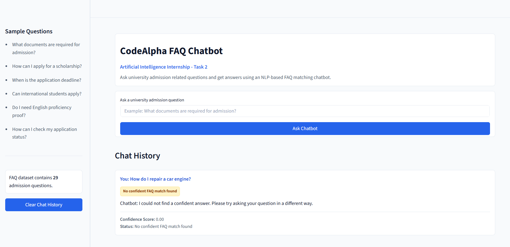

# CodeAlpha FAQ Chatbot

## Internship Domain

Artificial Intelligence

## Task Name

Task 2: Chatbot for FAQs

## Project Overview

CodeAlpha FAQ Chatbot is a simple university admission FAQ chatbot built with
Python and Streamlit. A user can ask an admission-related question, and the app
returns the most relevant stored FAQ answer.

This project is intentionally simple and beginner-friendly for a CodeAlpha
Artificial Intelligence Internship submission.

## Project Objective

The objective of this project is to build a FAQ matching chatbot that:

- Stores university admission FAQs inside the project.
- Preprocesses user questions.
- Uses TF-IDF vectorization.
- Uses cosine similarity to find the closest FAQ question.
- Displays a fallback response when the similarity score is low.

## Features

- User can ask a university admission question.
- Stored FAQ questions are cleaned before matching.
- User questions are cleaned before matching.
- TF-IDF vectorization is used for text representation.
- Cosine similarity is used to select the closest FAQ.
- Chatbot answer is displayed in a clean response card.
- Matched FAQ question is shown for confident answers.
- Category is shown for confident answers.
- Confidence score is displayed.
- Fallback response is shown for unrelated questions.
- Chat history works during the current Streamlit session.
- Clear Chat History button is included.
- Sample questions are visible in the sidebar.
- Empty input validation is included.

## NLP Approach

This project is a FAQ matching chatbot, not a generative AI chatbot.

The NLP process is:

1. Store FAQ questions, answers, and categories in `faq_data.py`.
2. Clean text using the `clean_text()` function.
3. Convert FAQ questions into TF-IDF vectors.
4. Convert the user question into a TF-IDF vector.
5. Compare vectors using cosine similarity.
6. Return the highest scoring FAQ answer when confidence is high enough.
7. Return a fallback message when confidence is low.

## Technologies Used

- Python
- Streamlit
- scikit-learn
- pandas

## Folder Structure

```text
CodeAlpha_FAQ_Chatbot/
├── app.py
├── frontend.py
├── chatbot.py
├── faq_data.py
├── requirements.txt
├── README.md
├── .gitignore
├── .gitattributes
├── .streamlit/
│   └── config.toml
└── screenshots/
    ├── home_page.png
    ├── chatbot_response.png
    └── no_match_response.png
```

## Installation Steps

1. Clone the repository.

```bash
git clone https://github.com/abdinasir600s-a11y/CodeAlpha_FAQ_Chatbot.git
```

2. Open the project folder.

```bash
cd CodeAlpha_FAQ_Chatbot
```

3. Create a virtual environment.

```bash
python -m venv venv
```

4. Activate the virtual environment.

Windows:

```bash
venv\Scripts\activate
```

macOS/Linux:

```bash
source venv/bin/activate
```

5. Install dependencies.

```bash
python -m pip install -r requirements.txt
```

## How to Run the App

Run this command from the project folder:

```bash
streamlit run app.py
```

## How to Use the Chatbot

1. Open the Streamlit app in your browser.
2. Type a university admission question.
3. Click **Ask Chatbot**.
4. Review the chatbot answer, confidence score, and status.
5. For confident answers, review the matched FAQ question and category.
6. Use **Clear Chat History** to reset the current session chat.

## Screenshots

### Home Page



### Chatbot Response



### No Match Response



## Demo Video

Add your demo video link here:

```text
Demo Video: Your LinkedIn or Google Drive demo video link
```

## GitHub Repository

```text
https://github.com/abdinasir600s-a11y/CodeAlpha_FAQ_Chatbot
```

## Author

**Name:** Abdinasir Osman Warsame  
**Role:** CodeAlpha Artificial Intelligence Intern  
**GitHub:** [abdinasir600s-a11y](https://github.com/abdinasir600s-a11y)

## CodeAlpha Acknowledgement

This project was created as part of the CodeAlpha Artificial Intelligence
Internship program.

## Disclaimer

This is a FAQ matching chatbot, not a generative AI chatbot. It does not use
OpenAI API, Gemini API, or any paid AI API. The chatbot only compares a user's
question with stored university admission FAQs and returns the most relevant
saved answer.
